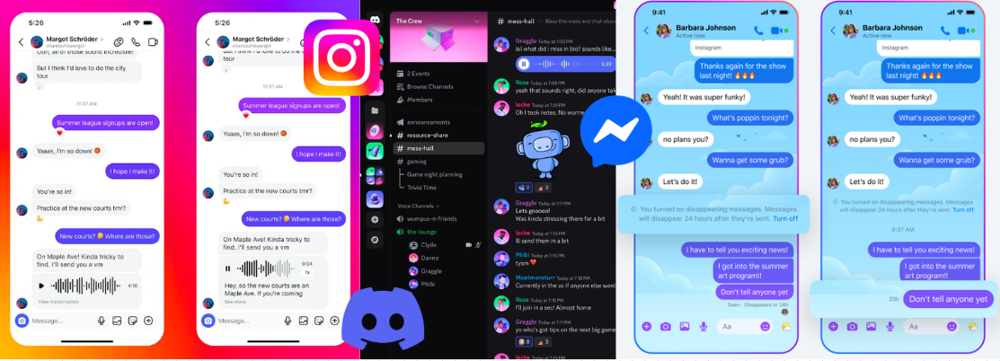
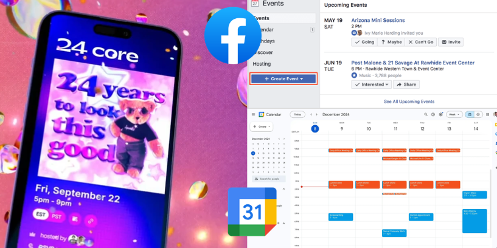
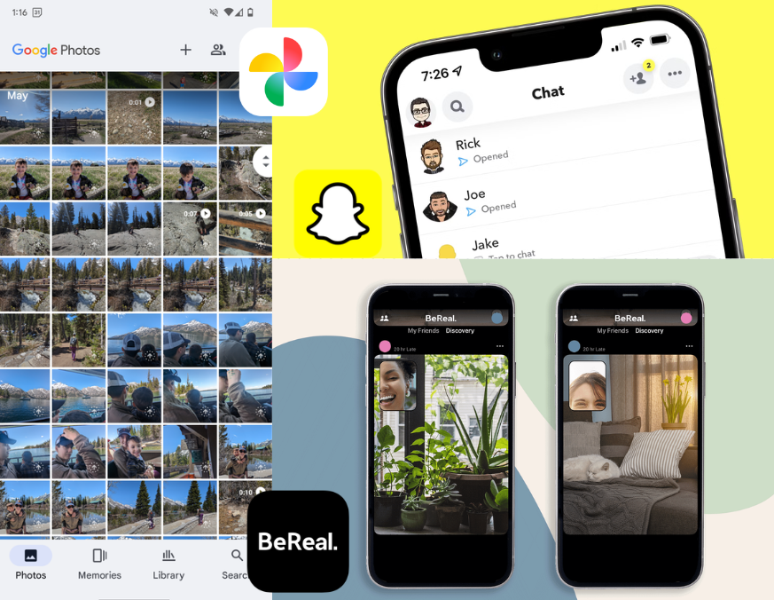
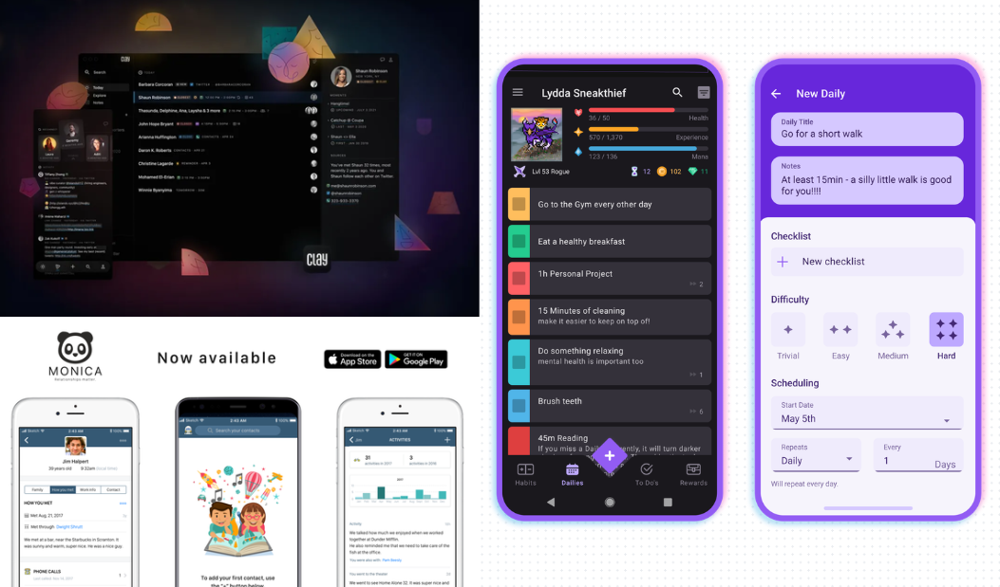
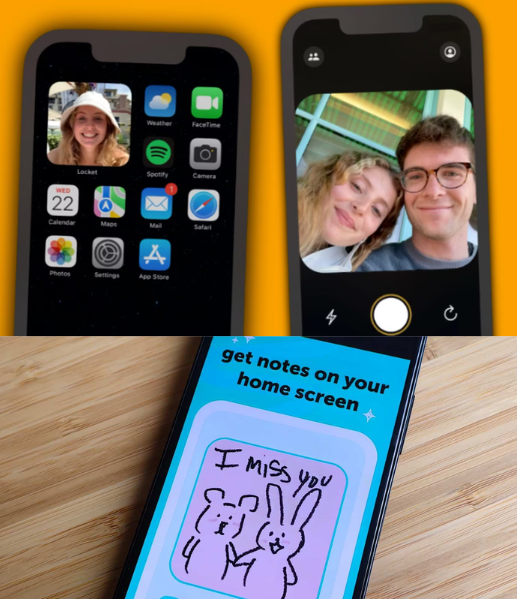

#### [Home](../README.md) | [Journal](../journal.md) | [Completed Findings](background-research-findings.md)

# Existing Tools

## Social / Communication

Platforms such as **Instagram**, **Discord**, and **Messenger** are currently the primary way people stay in touch with their friends.

These tools are highly effective for communication, allowing users to send messages, share media, 
maintain group chats across different social circles. However, they often result in fragmented interactions, 
as different friend groups exist across different platforms. 
This directly reflects the issue I personally experience when trying to organize or maintain connections.

More importantly, while these platforms support communication, they do not actively support the maintenance of friendships. 
There is little to no emphasis on intentionality, reflection, or helping users nurture relationships over time.

## Event Planning / Coordination

Tools such as **Partiful**, **Facebook Events**, and **Google Calendar** focus on organizing and coordinating events.

These platforms are useful for logistics, offering features such as invitations, polls, scheduling, and RSVP systems. 
However, they tend to be designed for more formal or large-scale events rather than casual, everyday hangouts between friends.

They also prioritize efficiency and organization over emotional connection. While they help answer “when are we meeting?”, 
they do not address “how do we stay connected?” or “how do we maintain this relationship over time?”

## Memory & Photo Sharing 

Applications such as **Google Photos**, **Snapchat**, and **BeReal** allow users to capture and share moments from their lives.

These tools are effective at documenting experiences and, in some cases, resurfacing past memories. 
For example, photo libraries may highlight past events or images taken on the same date in previous years.

However, these memories are not meaningfully tied to specific relationships. 
They exist as isolated moments rather than as part of an ongoing narrative between people. 
There is also little support for using these memories as a way to actively reconnect or maintain friendships.

## Relationship / Habit Tracking

Tools such as **Clay**, **Monica**, and **Habitica** introduce the idea of tracking interactions, habits, or personal data over time.

Some of these platforms, particularly personal CRM (customer relationship management) tools, allow users to log interactions, set reminders to reach out, 
and store information about people in their lives. This begins to align more closely with the idea of intentional relationship maintenance.

However, these tools often feel transactional or productivity-driven. 
They are frequently designed for networking or professional relationships rather than genuine friendships. 
As a result, they lack emotional depth, playfulness, and the sense of care that characterizes meaningful platonic relationships.

## Niche Friendship Apps

More recent or experimental apps such as **Locket** and **NoteIt**, explore more intimate and low-pressure forms of social interaction.

These platforms often focus on smaller groups or one-on-one connections, emphasizing authenticity and reducing the performative 
nature of traditional social media. They represent a shift toward more personal and emotionally grounded digital interactions.

However, their scope is typically limited. While they support connection in small ways, they do not provide tools for
long-term friendship maintenance, shared planning, or deeper understanding of relationships over time.

---

## Summary

Across these categories, it becomes clear that existing tools tend to address specific aspects of friendship, communication, 
planning, memory, or tracking, but do not bring these elements together into a cohesive system.

There is currently a gap for a platform that supports friendships more holistically, particularly one 
that encourages intentionality, reflection, and sustained connection. 
This project aims to explore that space by combining these fragmented functions into a single, more meaningful experience centered around
