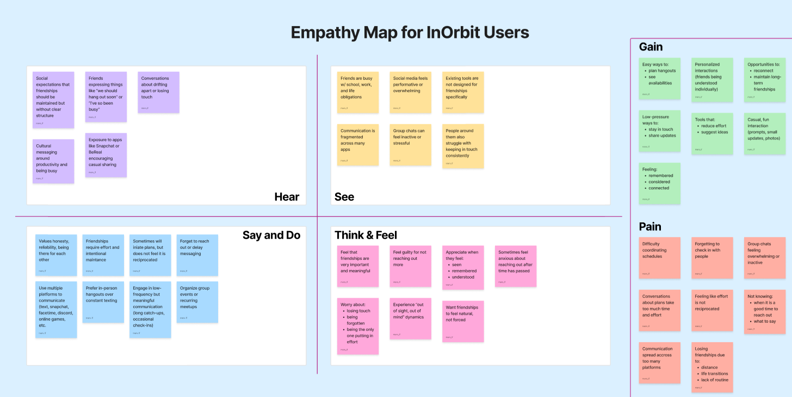
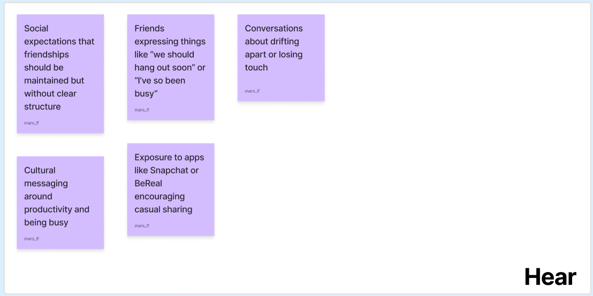
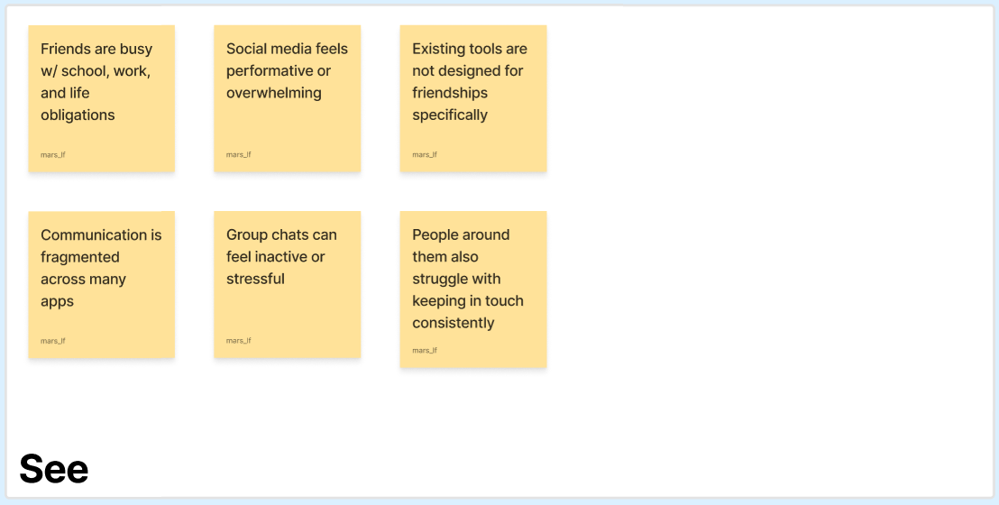
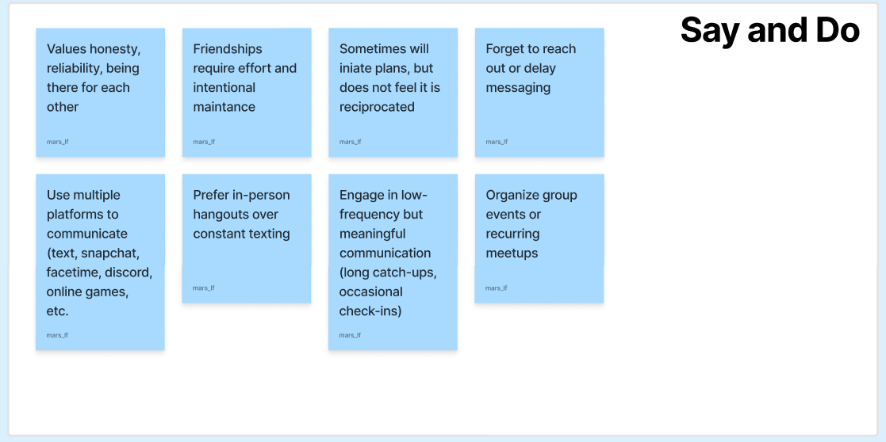
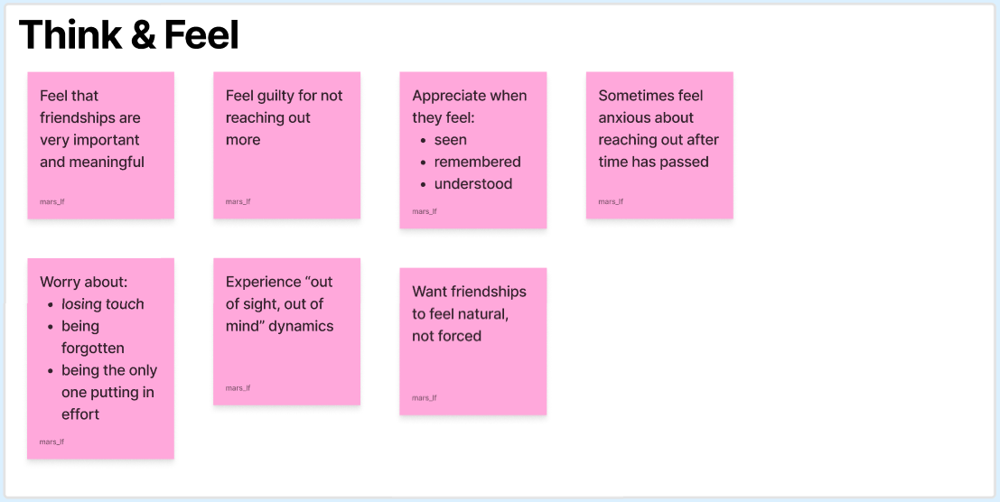
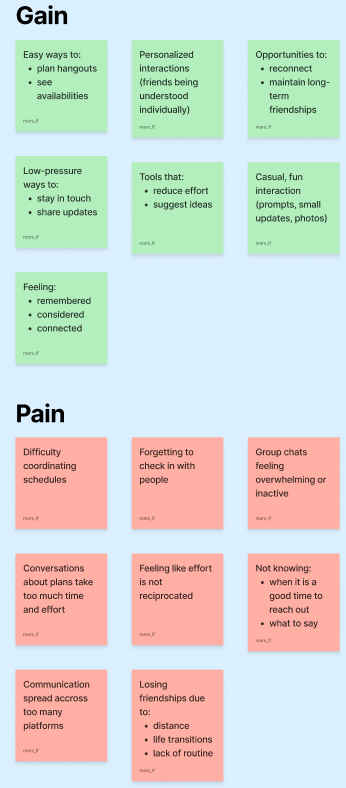

#### [Home](../README.md) | [Journal](../journal.md) | [1- Problem Space](../01_problem-space/brainstorm.md) | [2- Background Research](../02_background-research/background-research-findings.md) | [3- User Research](user-research-findings.md) | [4- Analysis](../04_analysis/analysis-summary.md) | [5- Prototypes](../05_prototyping/prototype-evaluation.md)

# User Research Findings

After completing my 5 interviews, I created an [empathy map](https://www.figma.com/board/nhElbppA5jBVV5bPPlDj0h/Final-Project-310?node-id=0-1&p=f&t=uHJr8Xh4zLAssgJr-0) to better understand patterns across participants and visualize their needs, behaviors, and emotions.

While the empathy map helped organize the data visually, I also identified several key themes that emerged across interviews.

**1. Friendship requires effort, but that effort is inconsistent**

Most participants expressed that maintaining friendships is important, but difficult to do consistently.
Busy schedules, different routines, and lack of coordination often lead to unintentional distance.
Many described an “out of sight, out of mind” dynamic, where friendships fade simply because they are no longer part of daily life.

**2. Communication styles vary a lot**

Participants highlighted that people give and receive care in very different ways:
- Some prefer quality time and in-person interaction 
- Others value low-pressure communication (messages, memes, quick updates)
- Many emphasized the importance of feeling understood and “known”

This suggests that a “one-size-fits-all” approach to maintaining friendships is ineffective.

**3. Low pressure interaction is preferred**

A strong pattern across interviews was a preference for casual, lightweight communication, such as:
- Quick updates (photos, short messages)
- Prompts or questions of the day 
- Passive interaction (reading updates without needing to respond publicly)

Participants expressed discomfort with:
- Group chats 
- Performative social media interactions (likes, comments, pressure to respond)

**4. Planning is a big hurdle**

Many participants identified planning as one of the biggest barriers to spending time with friends:
- Difficulty aligning schedules 
- Too much effort required to decide on activities 
- Conversations about planning often leading to no action

There is a clear need for tools that reduce decision fatigue and simplify coordination.

**5. Distance does not always mean disconnection**

Interestingly, several participants described friendships where:
- They speak rarely (sometimes only a few times per year)
- But still feel emotionally close

This suggests that frequency of interaction is not the only indicator of closeness, and that tools should 
respect different types of friendships rather than enforce constant communication.

**6. Fear of one-sided effort**

Some participants expressed hesitation in reaching out due to:
- Feeling like they are the only one making effort 
- Uncertainty about whether the other person still values the friendship

This creates a feedback loop where both people may care, but neither reaches out.

### Key Insight

Overall, the interviews reveal that the main challenge is not a lack of desire to maintain friendships, 
but rather a lack of tools that support intentional, low-pressure, and personalized connection.

### Design Implications

- Tools should support low-effort interaction, not demand constant engagement
- Features should adapt to different friendship styles and communication preferences
- Planning tools should reduce friction and decision-making effort

