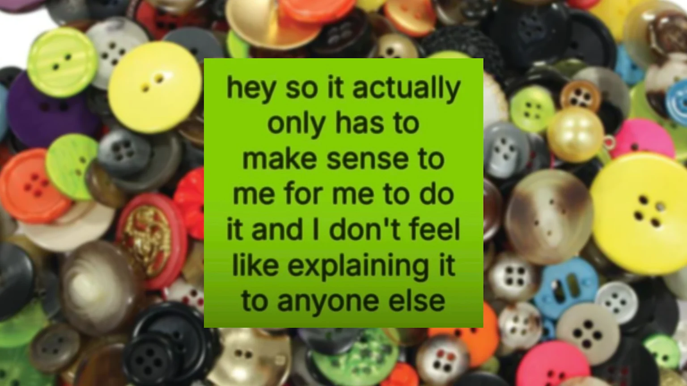
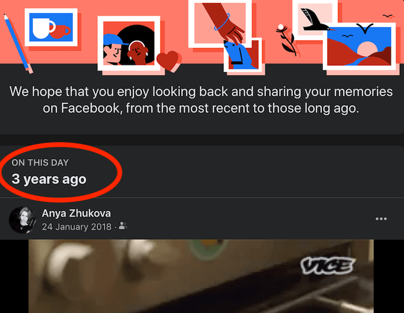
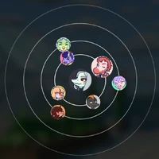
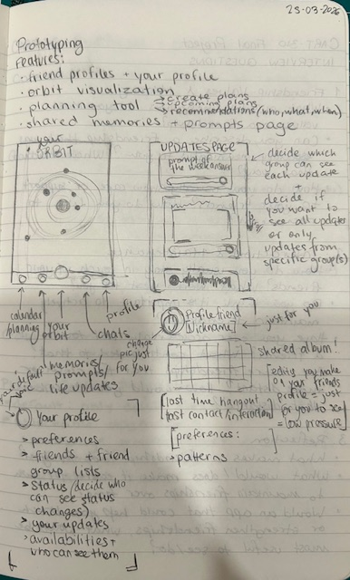
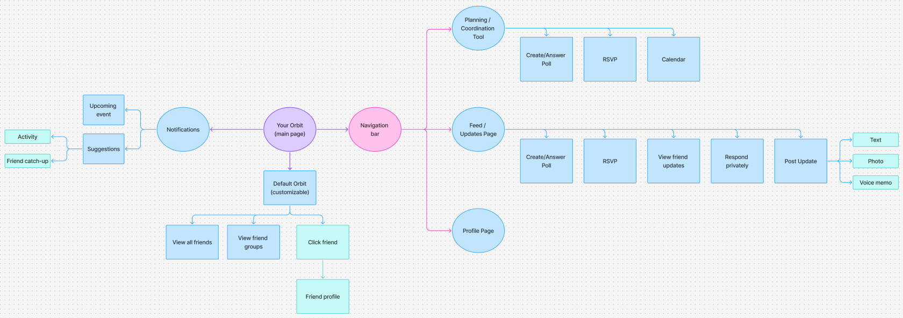
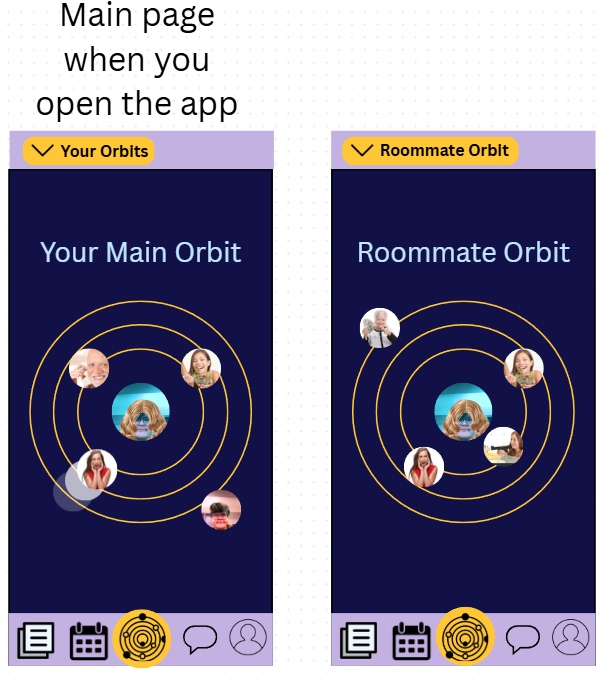
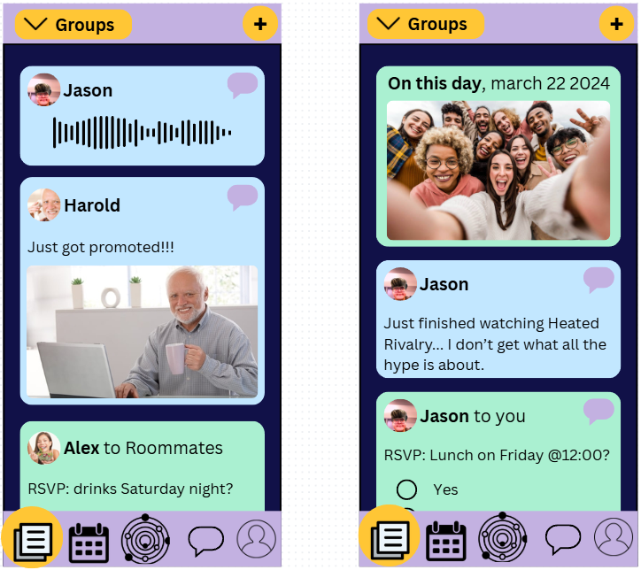
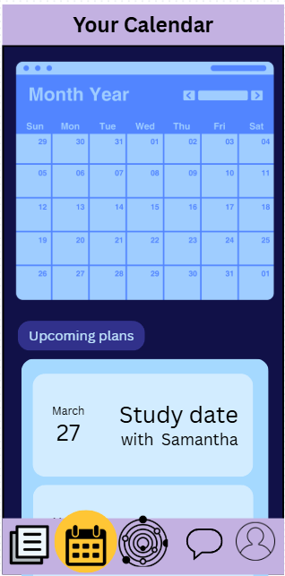
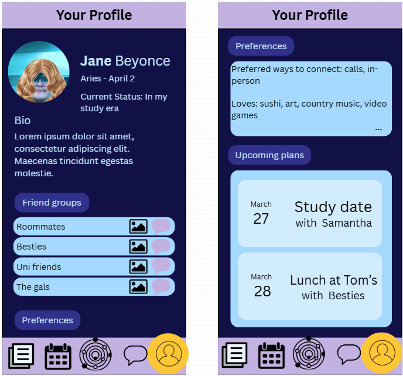

#### [Home](README.md) | [Journal](journal.md) | [1- Problem Space](01_problem-space/brainstorm.md) | [2- Background Research](02_background-research/background-research-findings.md) | [3- User Research](03_user-research/user-research-findings.md) | [4- Analysis](04_analysis/research-analysis.md) | [5- Prototypes](05_prototyping/prototype-evaluation.md) 

# CART-310 Final Project - Process Journal

This document will serve as a process journal to track my progress throughout the project.

It is meant to capture my ongoing thoughts, reflections, decisions, and next steps in a chronological way, 
so the full evolution of the project can be followed in one place. 
The entries won't be as formal or structured as the rest of my documents for that reason (I tend to ramble at times), but they will properly show the chronological evolution of the project.

Unlike the other markdown files, which focus on more finalized or directly relevant content (such as research findings or specific ideas), 
this journal is more informal and process-based. 

---

---

## 17-03-2026

For the last few weeks, I have had many ideas bobbing around in my head. I thought of parts of my identity I could locate problem spaces in.
I thought about a recipe / baking social app to share recipes, photos and ideas; however I feel like apps like Pinterest, Instagram, 
and Tiktok already fill those needs.
I thought about a reading tracking app; the market is already super saturated but I've heard from many people (and think so as well) 
that there isn't like one app that truly fulfills all the wants/needs that the audience can think of. 
Still, the market is super saturated with apps like Liby, GoodReads, Storygraph, and many many many many more, so this isn't a great idea either.

I came up with another idea which led to the idea I want to work towards for this project. I am someone who hosts and organizes a lot of hangouts with my friends
I am THE friend that doesn't just say "hey we should do something together soon", I actually plan stuff and make plans happen.
However, I find it frustrating sometimes because I have friends that mostly only check messages, or only instagram, 
I have friends that only have discord, or who only text with messenger most of the time. 
So, when I want to plan stuff with many friends, I need to always use multiple different platforms to contact them. 
I have created a discord group with these friends, but for the ones who rarely check discord, 
So my initial idea for this problem-space is to create a platform to simplify planning hangouts / outings with friends 
and provide related tools, such as chats, polls, shared lists, common photo albums, etc. all in a _singular_ app.

I liked this idea the most but the scope felt really small and I wasn't even sure if it was actually going to be helpful enough to actually feel enticing to use/worth using.
The scope needed to be expanded. The larger theme of the initial idea, if you take a step back, is the idea of friendship and sustaining those bonds.
From that point, I kept thinking and came up with a few potential “How Might We” questions:

- How might we support people in being more intentional with their friendships?
- How might we make planning casual hangouts feel easy and enjoyable instead of stressful?
- How might we help friend groups stay connected beyond just messaging?

I also brainstormed some features I thought this platform could offer, but of course background and user research must be done 
before I actually figure out and decide. Anyways my initial feature ideas are: 
- Planning tools (polls, availability, shared lists) but designed for *casual* hangouts, not formal events
- Shared memory spaces (photos, notes, quotes, “moments” from hangouts)
- Push notifications: light reminders to reach out or make plans (non-intrusive, casual, not productivity-focused)
- Tracking ideas for future hangouts (movies to watch, recipes to try, places to go)
- if friend doesn't have app = create a placeholder character / profile so you can still create reminders and stuff 
- facebook style memory reminders + birthday reminders = sparking memories to remind

I also started doing some [academic research](02_background-research/academic-research.md) on relating topics. I read a 
short [article](https://www.apa.org/monitor/2023/06/cover-story-science-friendship) about the benefits of friendships
which proves that this tool which could help sustain meaningful platonic bonds can have a real concrete positive impact on users.
I also read an [article](https://www.happiness.hks.harvard.edu/february-2025-issue/the-friendship-recession-the-lost-art-of-connecting) 
that discusses how the art of connecting is disappearing due to cultural trends contributing to social isolation. 
Again, this article proves that there is actual need / problem and this platform could counteract these trends.

---

## 18-03-2026

During class, we were given time to talk one-on-one about our project idea to get some feedback and ideas if we wanted to.
I really wanted some feedback to see if my idea was actually interesting and something people would possibly use.
I found the discussion really helpful and it helped me transform it in my mind from a vague idea to something I could actually visualize.
We came up with lots of really great ideas (thank you Rilla ♥ !!!).

Like I mentioned in the previous entry, my platform idea is to simplify keeping up with friends and maintaining/strenghtening platonic bonds.
I am going to list and describe the ideas that came from the discussion in no real logical order, anyways here we go!

### Discussion Summary Notes
focus: intentional friendship
- what people value in friendships = remind people and easy to remember via the app= example if someone values words of affirmation, or if their prefered method of communication is calls over text
- facebook style blast from the past
- goodbye volcano high = ring visualization of closeness
- maybe space themed = gravity pull + falling out of orbit
- interaction history ? meta app "tracking" interactions of other app thru ur platforms
- is this person still your friend = exo planet / out of orbit / pluto / drifting apart
- example: you buy concert tickets + history of going to concerts w/ person A = do you want to invite them to go with you?

### Personalizing Friendship

We thought about working with the general idea of [the 5 love languages](https://www.mindbodygreen.com/articles/the-5-love-languages-explained?srsltid=AfmBOoqOymm5w5zanjJqV6OtrAU5Clx-HqXxMLyNEf0bKvHm4R_K3DGO).
(WARNING this is gonna be a not super important tangent/ramble! I started writing and only realized until it was too late and since this is a journal oh well! Read it or don't, it is up to you) 
I think they are more often used when talking about romantic relationships, but I don't even fully agree with the whole idea that your 
romantic partner is the most important end all be all bond in your life. Obviously you won't connect as deeply with all friends, 
but I do think platonic love is so undervalued, and it is so important for us to nurture and hold onto those relationships, even after you get into a romantic relationship.
This is a reason why I think this app could be genuinely helpful. But I digress... 

The idea here would be to have people's favourite love languages, so you could receive customized / personalized reminders for each person. 
I also think this idea can be pushed further and have it be even more personalized, so the algorithm of the platform could learn more than just your friend's
preferred love languages, but it can also remind you of their favourite snacks or activities they enjoy.
Like if your friend Sam really likes quality time, you could receive a notification that says 
something along the lines of: |You haven't checked in with Sam in a while, how about you two go see a movie in theater's this weekend! You're both free Saturday night!!"
In summary, the idea is to personalize it for what each person needs/wants/values in a friendship. + Help you be a better (more intentional) friend! 

### Nostalgia as a Trigger

Another idea that came up is inspired by those Facebook _On This Day_ notifications. Most of the time, on Facebook, they really miss the mark because
they remind you of the most random stuff like a random coworker that you haven't spoken to in 3 years wishing you a happy birthday 4 years ago
or just random posts that are meaningless. However, since this app will really just be used for friendships, it won't be littered with random meaningless posts and pictures.
I already wanted to add shared photo album spaces, so if you haven't hung out with a group of friends in a while, 
it can choose a memory from the album and remind you of them. Who wouldn't feel nostalgic and want to reach out?

### Visualizing Closeness

During our discussion, Rilla thought of the game _Goodbye Volcano High_ and how they visualize how close you are to the NPCs in the game.
They use these rings that are surrounding you and the NPC pictures can move closer or further away from you depending on how close you are to them. 
I don't know the game but it looks a lot like planets around the sun with their orbits.

I really love the visuals and I definitely think I could implement this type of feature in my platform. The second she showed me a picture I thought of 
seeing closeness like orbits. I really like the idea of leaning into that space theming for the entirety of the platform (form following function?)
It feels right because it is right. This inspired me even further. 
If there is a growing distance between you and someone, you could see it as losing your gravitational pull or falling out of orbit.
If you no longer want to be friends with someone (for whatever reason), you could release them from your orbit, or turn them into an exo planet / pluto.
Anyways, I really like this idea and can't wait to explore how I can push it.

### Smart Suggestions

An issue that came up is how will my platform track your interactions with your friends if you use other platforms. 
We decided to disregard that issue and just decide to say that it can (meta). 
This opens up other opportunities like the possibility for the app to recommend invites. 
The example we came up with was if you buy concert tickets and you have a history of going to concerts with Anthony and he listens to that artists,
then the app will suggest you invite Anthony to go to that concert you just bought tickets for. 
It can help suggest easy ideas that you will both enjoy, so you can use that brain power for other things. 

---

## 19-03-2026

This morning I wrote the [interview questions](03_user-research/interview-questions.md) for the user research part of this project. 
Since friendship is so unique to each person I opted to go with the interview/discussion rather than a survey like some people did.
I also don't think observation / think-aloud sessions will be helpful for this either. 
I also decided to use the questions as more of a guide for the conversation with each interviewee but when they wanted to focus
on something in particular, I let them steer the discussion in that direction. 

I had my CART-315 Game Prototyping class today. We just had to do our quick project check-in, then we were free to go home or work on our projects in class.
So I decided to use this time to conduct a few interviews with some classmates. 
I was able to get 4 done and I found them interesting and insightful.
People would clearly find use in my project if it ever became a real app. 

The interviewees brought up their own ideas/features they would find useful when it comes to staying connected with friends.
Here's what people thought would be very helpful to them:
- newsletter style update of your friends life = you can respond/comment but just privately so that it doesnt feel so performative and like social media (instagram and al.)
- prompts that you can answer and see your friends answers = spark discussions , not everyday , low pressure and random
- shared calendar super useful to figure out availabilities

To record the [interviews](03_user-research/interview-recordings) I simply used my phone and then to write the [transcripts](03_user-research/interview-transcripts.md), 
I used [Vibe](https://thewh1teagle.github.io/vibe/) which is free, open source, and according to what I read online, very reliable and accurate.
I still have at least 1 more interview to get done to hit the minimum, but if I can, I definitely want to get more done 
because I found them very beneficial.

---

## 22-03-2026

Today I took some time to properly look into [existing tools](02_background-research/existing-tools.md) that relate to my project idea. 
I had already explored a lot of these apps before, but I realized I hadn’t actually documented any of it in a structured way, 
so I went back and wrote it all down.

Looking at everything side by side made something really clear: there are a lot of tools that do parts of what I’m imagining (messaging, planning, memory sharing, etc.), 
but none of them really bring it all together in a way that supports maintaining friendships intentionally. 
They all feel a bit fragmented or focused on one specific function.

This was actually reassuring because it makes the idea feel more valid and worth exploring.

I’ve also been thinking a bit about naming, and I really like **InOrbit** as a potential name for the platform. 
It connects well with the space theme and the idea of friendships existing in different levels of closeness, 
like people moving in and out of your orbit. It feels fitting for the direction this project is going in.
I am going to use this as a placeholder. It could potentially be the final name I use, but I might also change it. 
I really like it, but I want to stay open to finding something better. 

---

## 23-03-2026

I am going to start my first prototype soon, but before jumping into that I want to take a step back and 
clearly outline the features I’ve been thinking about. Up until now, a lot of my ideas have been more conceptual and 
scattered across notes, so I think this will help me ground the project and make more intentional design decisions moving forward. 
I also want to avoid trying to do too much at once, especially for the first iteration.

Because of that, I want to separate what feels essential to the core idea of the platform from what would be nice additions, 
but are not necessary for it to function or communicate its purpose. This should help me stay focused and make sure 
my prototype actually reflects the main goal of supporting intentional friendships, rather than just becoming 
a collection of features.

### Pages:
- your profile + your friend profiles + friend groups
- orbit visualization
- planning / coordination tool 
- shared memories + weekly prompt answers + life update feed of your friends 
- chat / interacting with friends 

#### Core Features

- **Friend Profiles:** Basic profiles for each friend including preferences (communication style, things they enjoy, etc.) = personalized and intentional
- **Closeness visualization (orbit system):** A central visual system showing relationships as orbits / distance, representing how close or distant you are from different friends
- **Interaction tracking:** A way to log or infer interactions over time (messages, hangouts, etc.) = maintaining relationships
- **Reminders to reach out:** Gentle, non-intrusive prompts based on time since last interaction or known preferences (customization?)
- **Shared memories (photos/moments):** A space tied to specific friendships or groups to store and revisit shared experiences
- **Simple planning tools (casual)**: Features like availability, polls, or notes to make organizing hangouts easier without making it feel formal

#### Extra Features 

- **Smart suggestions:** Recommending activities or people to invite based on past interactions or shared interests
- **Memory resurfacing / nostalgia triggers:** Bringing back past shared moments to encourage reconnection
- **Friendship “insights”:** Patterns like how often you see someone or how relationships change over time.
- **Prompts / conversation starters:** Occasional low-pressure prompts to spark interaction or deeper conversations.
- **Shared group spaces (albums, notes, ideas):** Expanded spaces for friend groups beyond just individual relationships
- **Upcoming plans**: reminders and notification page maybe to see what is upcoming and who you should schedule plans with

Overall, I think this helped me clarify what actually matters for this project. It’s easy to get carried away with adding features, 
but at the end of the day I just want this to feel meaningful and true to the idea. Now I feel a bit more grounded going into the first prototype.

---

## 24-03-2026

I had class all day until 9:45 but thankfully Michael let me interview him after our class together. Yay! I got all of the interviews done! 
I also did some minimal restructuring / organization of my repo just so that navigation between sections could be easier! Very minor edits though.
I once again used Vibe to transcribe the last interview and added that to the [interview transcripts](03_user-research/interview-transcripts.md) file. 
I also added the recording into the proper folder. 

Since I had finally gotten all 5 interviews done, I took the time to go through them again and analyse the patterns I noticed.
I created an [empathy map](https://www.figma.com/board/nhElbppA5jBVV5bPPlDj0h/Final-Project-310?node-id=0-1&p=f&t=uHJr8Xh4zLAssgJr-0) 
using a template on Figma. 

I also wrote a written analysis because it helped me get all my ideas in order and organized instead of jumbled in my mind.
Both the written user findings and the empathy map are in the same 
[user research findings document](03_user-research/user-research-findings.md).

A few days ago, I had completed the [academic research](02_background-research/academic-research.md) that related to my topic 
and researched the [existing tools](02_background-research/existing-tools.md) that overlapped with my project 
but did not properly address all the needs I wanted to meet. However, I realized that I didn't write the background research findings, 
which meant I hadn’t yet synthesized the insights from both the academic research and the existing tools to clearly show how they connect to my project. 
Writing the background research findings allowed me to tie these pieces together, identify gaps in the current landscape, 
and justify the direction and purpose of my project.

---

## 25-03-2026

Now it was time to create my first prototype. 
I didn't really know where to start. To be honest, my brain felt like mush and I felt like I had never seen an app in my life.
Michael recommended I find inspiration on a few sites; [Web Design Museum](https://www.webdesignmuseum.org/) 
and [Behance](https://www.behance.net/search/projects/app%20design%20mobile).
[Web Design Museum](https://www.webdesignmuseum.org/) was not the most helpful for my vision but it was fun to look around, and
I think it could be interesting to explore more if I wanted to go towards a more creative/unique/"retro" direction.
[Behance](https://www.behance.net/search/projects/app%20design%20mobile) was very useful though because I could look into
lots of modern apps and how they organized their layout. 
I do want to try to go in a less standardized direction and experiment / play with the design of my app. 
However, before I play around and experiment, I want to establish a foundation and a layout that users can easily navigate.

I started by drawing up a few sketches and figuring out what I wanted to focus on for the first prototype.
I sketched out the main orbit page layout first since it is the key / central idea of my platform.
I also sketched the Friends Updates / Feed page because this was another super important feature for my project.
You can post just written text, prompt answers, photos, and voice memos.
When you post, you will also be able to decide who is able to see each of your posts (either friend groups or individual friends).
You will also be able to decide which groups you want to see updates from.
Finally, I decided what the profile would show.

It honestly still felt a little too vague in my mind to go directly into making a proper first rough prototype.
I needed to make my plan more grounded and more concrete from my mind into reality, so I create a 
[flowchart](https://www.figma.com/board/OZs4BeMmI1TxNxvRWHxU4W/Flowchart---final-project-310?node-id=0-1&t=nPLXSmqjRQMEsY5g-1) on Figma.
This particularly helped me establish the features that would be avaible on each screen and how the user would navigate the app.

After that, I finally felt ready to move into actually building the first prototype.

I ended up creating a bottom navigation bar to switch between the main sections of the app: your orbits, your updates feed, 
your calendar, your messages, and your profile. 
This helped ground everything and made it feel like a real, navigable app instead of just separate ideas.

I started with the main orbit page, since that is really the core of the whole concept. This is the first page you see when opening the app. 
You can view your main orbit, and there is also a tab to switch between different orbits (friend groups). 
This felt important to establish early on since everything kind of revolves around these social circles.

Then I moved on to the updates / feed page, which I think is one of the most important parts of the experience. 
On this page, you can see your friends’ updates, which can be photos, text, or voice memos. 
I also added two other types of content:

- “On This Day” memories, which show a shared memory with a friend from a previous date to act as a nostalgia trigger and encourage reaching out
- Invites / RSVP requests from friends 

To make these easier to distinguish, the memories and RSVP requests are displayed in a different colour than regular updates. 
Each post has a reply button, but there are no public comments or likes. 
All responses are private, which helps avoid the pressure and performative feeling of traditional social media.

I also created the calendar page, where you can see your upcoming plans. 
There is a calendar view at the top, and below it a list of upcoming events organized chronologically (closest to furthest), 
showing what the plan is and who it is with. This keeps planning simple and easy to reference.

Finally, I worked on the user profile page (although I still need to design the friend’s view of a profile). 
On your profile, you can see your picture, birthday, current status, and a short bio. 
There is also a section showing your orbits, where you can access shared photo albums or message people. 
I also included preferences, such as ways you like to connect and your favourites, which are visible to your friends.

I made a conscious decision to limit what others can see on your profile. 
Friends can see your basic info and preferences, but not your orbits or your upcoming plans. 
I want to avoid making the app feel socially competitive or overly social-media-like.

I didn’t have time to complete every page (like messages and the friend profile view), but I focused on building the core parts of the experience first.

Overall, this feels like a really solid first step. It’s the first time the project actually feels like a real app instead of just an idea in my head. 
Seeing all the pages connected together made me realize that the concept can actually work in practice, not just theoretically. 
It also helped me notice what still feels unclear or missing, especially in terms of flow and how certain features will actually be used. 
I still have a lot to refine and build, but having this foundation makes the next steps feel a lot more manageable and less overwhelming.

## QUICK TIMELINE FOR REST OF PROJECT PROCESS

**05-04-2026:** Prototype 2: Login / Account creation

**07/08-04-2026:** Protype 3: App main pages

**10/11-04-2026:** Final Prootype (4) : all pages + aesthetic makeover
